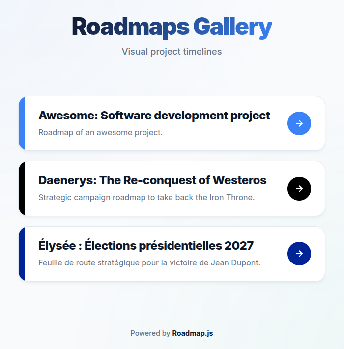
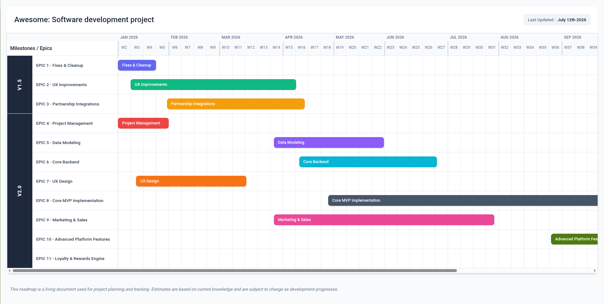
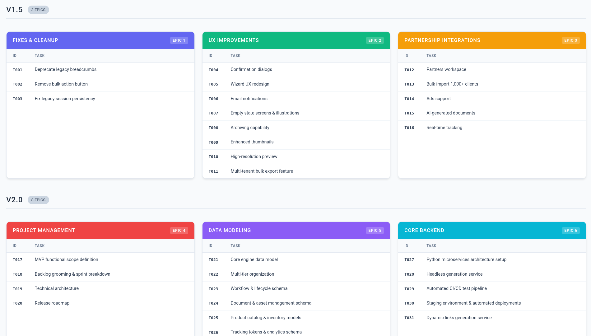
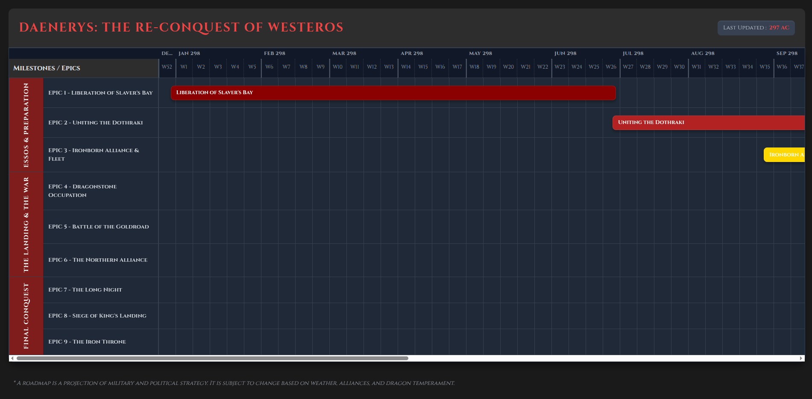
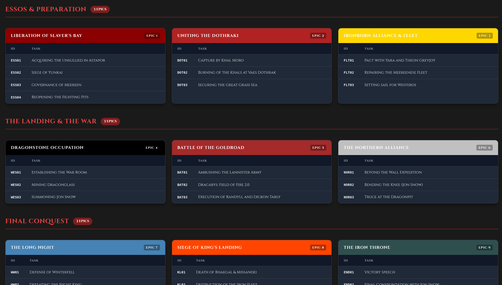
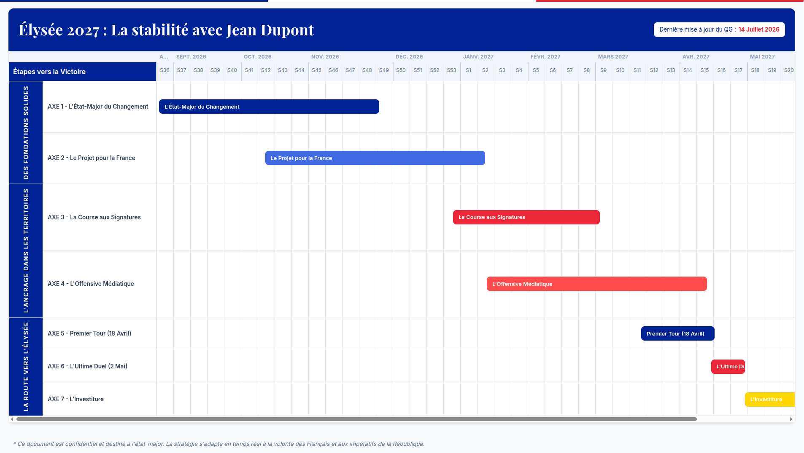
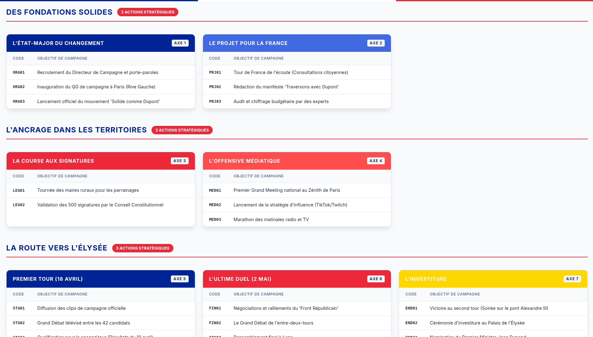

# Roadmap.js 🛣️🗺️

[](https://opensource.org/licenses/MIT)

**Roadmap.js** is a lightweight, dependency-free JavaScript library to generate beautiful web project roadmaps from simple JSON data.

## 🔗 **[Live Demo](https://glepretre.github.io/roadmap.js/)**

<p align="center">
  <a href="https://glepretre.github.io/roadmap.js/">
    
  </a>
</p>

## Features

- 🚀 **Lightweight & Fast**: Zero dependencies, minimal footprint.
- 🎨 **Beautiful UI**: Modern, clean design out of the box.
- 📱 **Responsive**: Works on desktops and tablets.
- 🌐 **Localization**: Easily translate all labels and date formats.
- 🛠️ **Customizable**: Control colors, epic details, and layout.
- 📄 **Standalone Export**: Built-in scripts to generate static HTML files for hosting.

## Installation

### via npm
```bash
npm install roadmap.js
```

### via CDN
```html
<script src="https://unpkg.com/roadmap.js/dist/roadmap.umd.cjs"></script>
<link rel="stylesheet" href="https://unpkg.com/roadmap.js/dist/roadmap.css">
```

## Quick Start

```javascript
import { Roadmap } from 'roadmap.js';
import 'roadmap.js/dist/roadmap.css';

const data = {
  name: "My Awesome Project",
  milestones: [
    {
      name: "Q3 2026",
      epics: [
        {
          id: "E01",
          name: "Core Engine",
          start: "2026-07-01",
          duration: { value: 8, unit: "weeks" },
          tasks: [
            { id: "T01", title: "Setup architecture", done: true },
            { id: "T02", title: "Implement parser", done: false }
          ]
        }
      ]
    }
  ]
};

const roadmap = new Roadmap({
  data: data,
  mountPoint: '#roadmap',
  lastUpdated: '2026-08-13',
  epicColors: {
    'E01': '#3b82f6'
  }
});

roadmap.init();
```

## Examples

The repository includes a gallery of examples in the `projects/` directory. You can use these as a template for your own projects:

| Project | Timeline | Epic Cards |
| :--- | :--- | :--- |
| **Awesome** |  |  |
| **Daenerys** |  |  |
| **Élysée** |  |  |

### Managing the Project Gallery

The main `index.html` acts as a gallery. To manage projects:

1. **Organization**: Projects are stored in the `projects/` directory. Use numeric prefixes (e.g., `01-project-name`) to control their display order in the gallery.
2. **Branding**: Define a `"themeColor"` in the project's `data.json` to customize its appearance in the gallery.
3. **Generation**: Run `npm run build` to automatically update the gallery index and generate standalone versions for each project.

## Data Format

The library expects a JSON object with the following structure:

```json
{
  "name": "Project Name",
  "milestones": [
    {
      "name": "Milestone Name",
      "epics": [
        {
          "id": "UniqueID",
          "name": "Epic Name",
          "start": "YYYY-MM-DD",
          "duration": { "value": 4, "unit": "weeks" },
          "tasks": [
            { "id": "T01", "title": "Task Description", "done": false }
          ]
        }
      ]
    }
  ]
}
```

### Interactive Task Completion

Click a task row in an EPIC card to toggle its `done` state for the current page. Interactive changes are not persisted and a page refresh restores the values from the source JSON.

## Configuration

| Option | Type | Default | Description |
| --- | --- | --- | --- |
| `data` | Object | **Required** | The roadmap data (milestones, epics, tasks). |
| `mountPoint` | String/Element | `document.body` | Where to render the roadmap. |
| `lastUpdated` | String | `""` | Date string shown in the header. |
| `epicColors` | Object | `{}` | Mapping of Epic IDs to hex colors. |
| `locale` | String | `'en-US'` | Locale for date formatting. |
| `monthFormat` | String | `'short'` | Format for month labels (`'short'`, `'long'`, `'numeric'`). |
| `translations` | Object | `{...}` | Custom translations for UI labels, see below. |

### Translations

You can customize the following keys in the `translations` object:

| Key | Default Value | Description |
| --- | --- | --- |
| `weekPrefix` | `'W'` | Prefix for week numbers (e.g., "W32"). |
| `weekOf` | `'Week of'` | Tooltip prefix for the start date of a week. |
| `labelColumn` | `'Milestones / Epics'` | Header for the first column of the roadmap. |
| `durationWeeks` | `'weeks'` | Label for duration in weeks. |
| `durationMonths` | `'months'` | Label for duration in months. |
| `epicsCount` | `'EPICS'` | Badge label for the number of epics in a milestone. |
| `idLabel` | `'ID'` | Column header for task IDs. |
| `taskLabel` | `'Task'` | Column header for task titles. |
| `emptyTasks` | `'No tasks defined for this EPIC.'` | Message shown when an epic has no tasks. |
| `startPrefix` | `'Start:'` | Prefix for start date in tooltips. |
| `durationPrefix` | `'Duration:'` | Prefix for duration in tooltips. |
| `epicPrefix` | `'EPIC'` | Prefix for Epic IDs (e.g., "EPIC E01"). |
| `lastUpdated` | `'Last Updated'` | Label for the last update date in the header. |
| `legend` | `'This roadmap is a living document...'` | Text shown at the bottom of the roadmap. |

## HTML Standalone Export

Run 

```bash
npm run build
```

Standalone HTML files are exported in `dist/<project>/index.html`.
The generated files can be hosted directly with no dependencies.

## PNG & PDF Export (Workaround)

Currently, there is no built-in PNG or PDF export feature. However, using a modern browser (e.g., Chrome/Chromium), you can:

### PNG Export

1. Open the roadmap webpage
2. Enable Responsive Mode in DevTools
3. Adjust the width to fit the entire timeline without a horizontal scrollbar (e.g., `2500px`)
4. In the `Elements` tab, right-click on `<body>`
5. `Capture node screenshot`

### PDF Export

1. Open the roadmap webpage
2. <kbd>Ctrl</kbd> + <kbd>P</kbd> (or <kbd>Cmd</kbd> + <kbd>P</kbd> on macOS) to Print
3. `Destination: Save as PDF`, `Layout: Landscape`, enable `Background Graphics`
4. Adjust `Paper Size`, `Margins` and `Scale`
5. `Save`

See example exports in the `export/` directory.

## Development

```bash
# Install dependencies
npm install

# Start development server
npm run dev

# Build for production
npm run build
```

## Release

Releases are published to both GitHub and npm. The commands below require push access to the repository, an npm account with access to the `roadmap.js` package, and the [GitHub CLI](https://cli.github.com/) for creating the GitHub release.

1. Merge all release changes into `main`, then update the local branch:

   ```bash
   git switch main
   git pull --ff-only
   npm ci
   npm run build
   ```

2. If the build updates `dist/`, review and commit those generated files before continuing.

3. Bump the package version according to [semantic versioning](https://semver.org/). This updates `package.json` and `package-lock.json`, creates a release commit, and tags it:

   ```bash
   npm version patch  # or minor / major
   ```

4. Push the release commit and tag, then create the GitHub release:

   ```bash
   git push origin main --follow-tags
   VERSION=$(node -p "require('./package.json').version")
   gh release create "v$VERSION" --generate-notes
   ```

5. Publish to npm. The `prepublishOnly` script rebuilds the package before publishing:

   ```bash
   npm login
   npm publish
   ```

6. Deploy the gallery and standalone examples to GitHub Pages:

   ```bash
   npm run deploy
   ```

The deployment script builds the project, replaces the contents of the `gh-pages` branch with `dist/`, and pushes the branch to GitHub.

## License

MIT © [Gilles Lepretre](https://github.com/glepretre)
